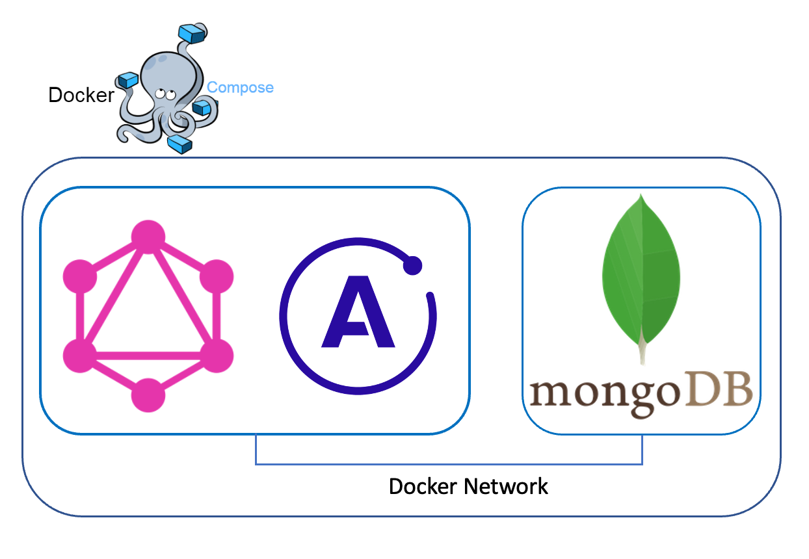
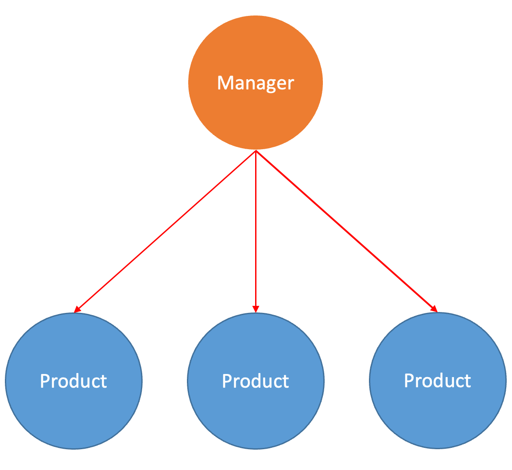

GraphQL CRUD
===
***
- Simple GraphQL CRUD playground using in-memory array
- This repository is a reference repository for my presentation on GraphQL during class (종합설계, [Prof. 김병서](http://bcnlab.hongik.ac.kr/professor.html))
***
**About GraphQL : https://velog.io/@hoplin/GraphQL**
***
# GraphQL Query, Mutation, Object used in Playground
```graphql

# Root Type : Query
type Query{
  getProduct(id: ID!): [Product!]!
  getManager(id: ID!): [Manager!]!
  getAllProduct:[Product!]!
  getAllManagers:[Manager!]!
}

# Root Type : Mutation
type Mutation{
  addManager(input: ManagerInput):MutationResponse!
  addProduct(input: ProductInput): MutationResponse!
  updateProduct(update: UpdateProductInput): MutationResponse!
  updateManager(update: UpdateManagerInput) : MutationResponse!
  deleteProduct(del: DeleteProductInput): MutationResponse!
  deleteManager(del: DeleteManagerInput): MutationResponse!
}

# Object : Manager
type Manager{
  id: ID!,
  name: String!,
  age: Int!,
  sex: Sex!,
  managingProducts:[Product!]!
  checkMyProduct(id:String!):Product!
}

# Object : Product
type Product {
  id: ID!,
  type: ProductType!,
  name: String!,
  price: Int!,
  description: String!
  managerid: String!
  discountedPrice(rate:Int!):Int!
  managerInfo:Manager!
}

```
- Resolvers exis in [here](./src/Resolver/)
***
# Playground Architecture


***
# Let's build playground!
First clone project and convert directory to playground source code directory!
```bash
git clone https://github.com/J-hoplin1/GraphQL-CRUD-Playground.git

cd GraphQL-CRUD-Playground
```

## Using Docker-Compose!

### Prerequisite

- Docker
- Git
- Docker Compose

### Let's move on
1. Build docker compose image

```bash
docker compose up -d
```

2. Connect to localhost 

```
localhost:4000
```
# Playground Schema Relation

### 1(Manager) : N(Product)


