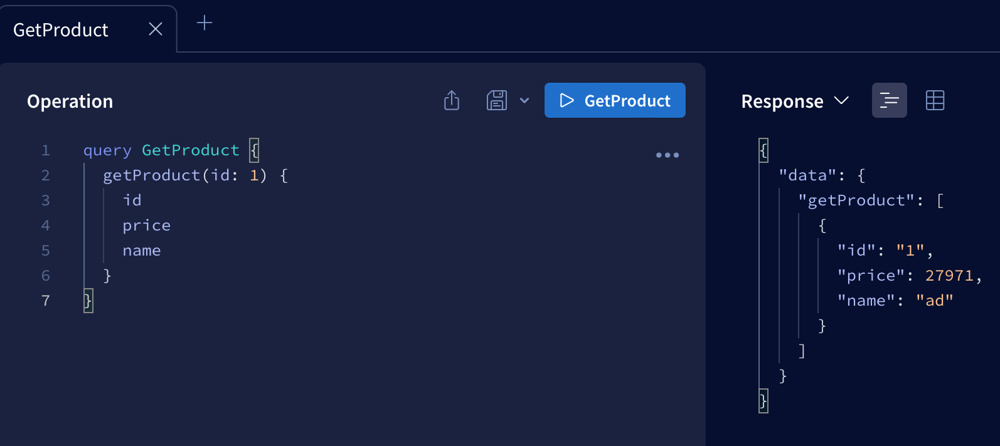
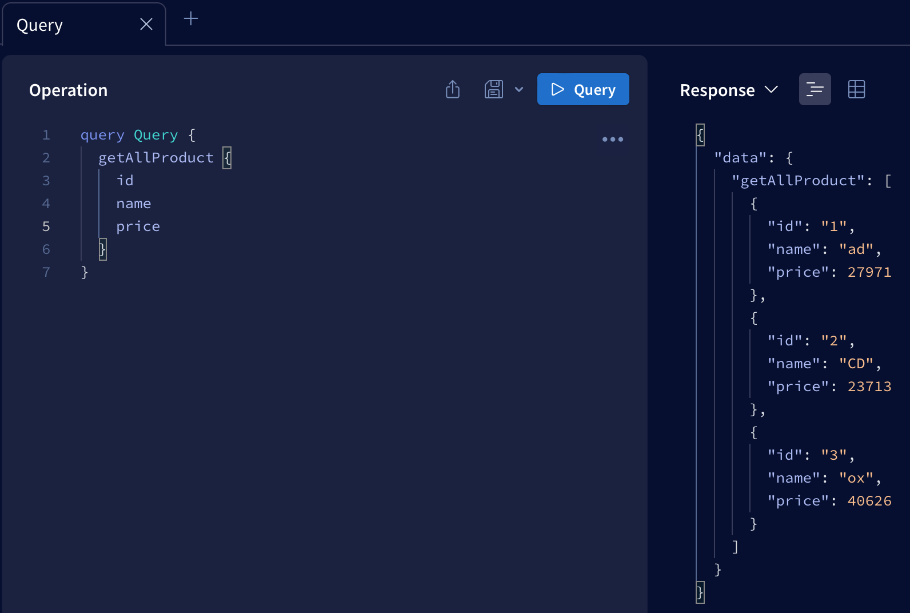
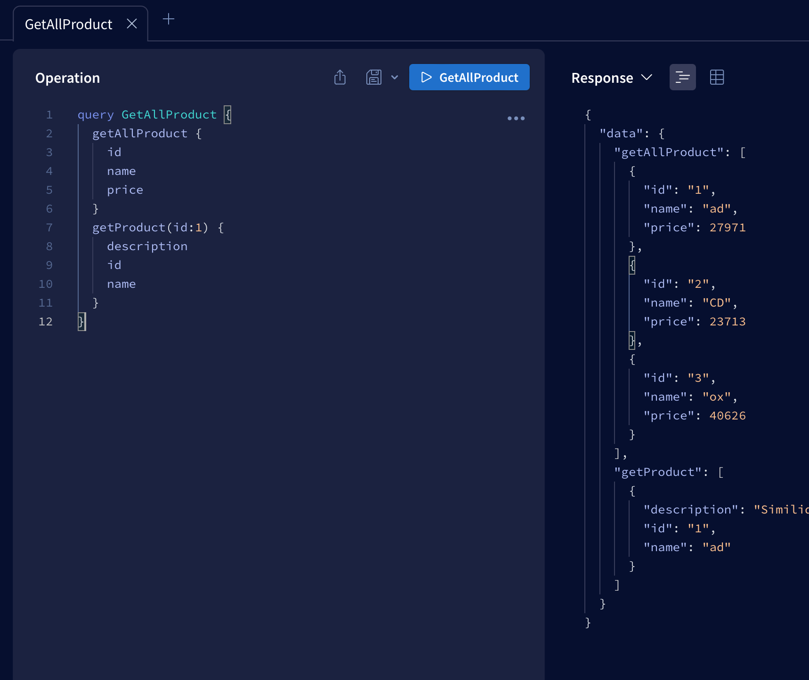

GraphQL CRUD
===
***
- Simple GraphQL CRUD playground using in-memory array
- This repository is a reference repository for my presentation on GraphQL during class (종합설계, [Prof. 김병서](http://bcnlab.hongik.ac.kr/professor.html))
***
# GraphQL Query, Mutation, Object used in Playground
```graphql

# Root Type : Query
type Query{
  getAllProduct:[Product!]!
  getProduct(id: ID!): [Product!]!
}

# Root Type : Mutation
type Mutation{
  addProduct(input: ProductInput): Boolean
  updateProduct(input: UpdateProductInput): Boolean
  deleteProduct(input: DeleteProductInput): Boolean
}

# Object : Product
type Product {
  id: ID!,
  name: String,
  price: Int,
  description: String
}
```
- Resolvers exis in [here](./src/Resolver/)
- **This playground do not use any SQL or NoSQL.(Data Persistency not in guranteed)**
***
# Let's build playground!

## Using local Node.js engine

### Prerequisite

- Node.js >= v.18

1. Install dev-dependencies

```bash
npm i -D
```

2. Install dependencies

```bash
npm i
```

3. Execute Server

```bash
npm run start-server-standalone
```

## Using Docker!

### Prerequisite

- Docker
- Git

### Let's move on
1. Build docker image

```bash
docker build -t graphqltest .
```

2. Run container with image

```bash
docker run -d --name gqtest -p 4000:4000 graphqltest
```

3. Connect to `localhost:4000` with your browser

```
localhost:4000
```
# How to use playground?

## GET
You need to connect to GraphQL Playground in `localhost:4000`. Type GraphQL Query in `Operation` tab and press blue button above to execute!

- Get all product values
  ```graphql
  query GetAllProduct {
    getAllProduct {
      id
      name
      price
      # You can add or delete other fields here
    }
  }
  ```
  

- Get product by id : Please type id you want to find
  ```graphql
  query Query{
    getProduct(id: (id you want to find) ) {
      id
      name
      # You can add or delete other fields here
    }
  }
  ```
  

- Get all product values & Get product by id
  ```graphql
  query GetAllProduct {
    getAllProduct {
      id
      name
      price
    }
    getProduct(id: (id you want to find) ) {
      description
      id
      name
    }
  }
  ```
  

## CREATE, UPDATE, DELETE
Some custom clients were build for playground in this [directory](./clients/). Please refer to commands under below 

- CREATE : create random product values using [faker.js](https://fakerjs.dev)
  ```bash
  // If playground is local node env
  npm run add

  // If playground is docker env
  docker exec gqtest npm run add
  ```

- UPDATE : Also update to new values using [faker.js](https://fakerjs.dev). **Require `id` value to update(Default is 1)**
  ```bash
  // If playground is local node env
  npm run update (id)

  // If playground is docker env
  docker exec gqtest npm run update (id)
  ```
- DELETE : Delete product values using `id` value.**Require `id` value to update(Default is 1)**
  ```bash
  // If playground is local node env
  npm run delete (id)

  // If playground is docker env
  docker exec gqtest npm run delete (id)
  ```